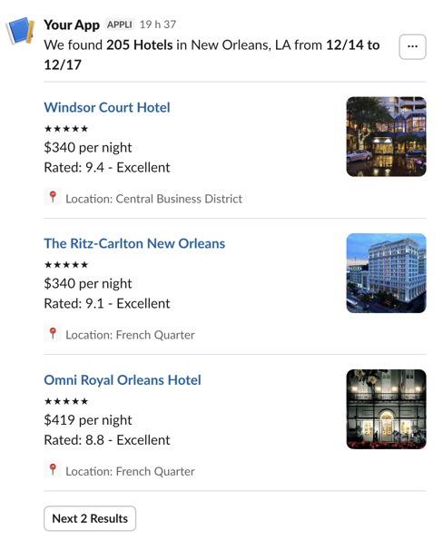

# slack-cli

A Rust CLI tool for sending messages to Slack.

## Installation

### From GitHub releases

Download the archive for your platform from the [releases page](https://github.com/sebastien/slack-cli-rust/releases), extract it, and move the binary to a directory in your `PATH`.

On macOS, the binary is not signed with an Apple Developer certificate. Gatekeeper will block it on first run. Remove the quarantine attribute to allow execution:

```sh
xattr -d com.apple.quarantine ./slack-cli
```

### Docker

```sh
docker run --rm -e SLACK_API_KEY ghcr.io/sblaisot/slack-cli-rust:latest \
  --channel "#general" --message "Hello from Docker"
```

Multi-arch images (`linux/amd64` and `linux/arm64`) are published to `ghcr.io` for every release tag.

### From source

```sh
cargo build --release
cp target/release/slack-cli /usr/local/bin/
```

## Configuration

Set your Slack API token using one of these methods (checked in order):

1. `SLACK_API_KEY` environment variable
2. `~/.slack/api-token` file
3. `/etc/slack/api-token` file

The token needs the `chat:write` scope.

## Usage

```sh
# Send a plain text message
slack-cli --channel "#general" --message "Hello world"

# Send with a title header
slack-cli --channel "#general" --message "Build passed" --title "CI Status"

# Send with a colored sidebar
slack-cli --channel "#general" --message "Build passed" --color "#36a64f"

# Pipe input from another command
echo "Deploy complete" | slack-cli --channel "#ops"

# Pipe a file
cat report.txt | slack-cli --channel "#reports"

# Send raw Block Kit JSON from a file
slack-cli --channel "#general" --blocks blocks.json

# Send raw Block Kit JSON from stdin
cat blocks.json | slack-cli --channel "#general" --blocks

# Raw blocks with colored sidebar
slack-cli --channel "#ops" --blocks alert.json --color danger

# Raw blocks with fallback text for notifications
slack-cli --channel "#ops" --blocks alert.json --message "New alert"
```

### Options

| Flag | Short | Required | Description |
|------|-------|----------|-------------|
| `--channel` | `-c` | Yes | Channel name or ID |
| `--message` | `-m` | No | Message text (reads stdin if omitted) |
| `--color` | | No | Hex color for attachment sidebar |
| `--title` | `-t` | No | Title displayed as a header above the message |
| `--blocks` | | No | JSON blocks file (stdin if omitted) |

## Message Format Behavior

| Condition | Format | Note |
|-----------|--------|------|
| No `--color` | Block Kit (plain text) | Modern Slack API |
| `--color`, message <= 4000 chars | Attachment with color sidebar | Only way to get color |
| `--color`, message > 4000 chars | Block Kit (no color) | Warning printed to stderr |
| `--blocks` provided | Raw Block Kit JSON | Blocks sent as-is |

The 4000 character limit is a Slack API constraint on attachment text. When exceeded, the message is sent without color and a warning is printed to stderr.

Note: `--blocks` and `--title` cannot be used together.

### Raw Block Kit JSON

The `--blocks` flag lets you send any [Block Kit](https://api.slack.com/block-kit) layout directly. The input must be a JSON array of block objects. This is useful for rich messages that go beyond plain text — such as images, buttons, context blocks, and dividers.

- `--blocks <path>` reads the JSON array from a file
- `--blocks` with no value reads the JSON array from stdin
- Combined with `--message`, the message text is used as the notification fallback (shown in mobile push notifications and desktop alerts)
- Combined with `--color`, the blocks are wrapped in an attachment with a colored sidebar
- Cannot be combined with `--title` (you control the full block structure)

For example, save the following as `hotels.json`:

```json
[
    {
        "type": "section",
        "text": {
            "type": "mrkdwn",
            "text": "We found *205 Hotels* in New Orleans, LA from *12/14 to 12/17*"
        },
        "accessory": {
            "type": "overflow",
            "options": [
                {
                    "text": { "type": "plain_text", "emoji": true, "text": "Option One" },
                    "value": "value-0"
                },
                {
                    "text": { "type": "plain_text", "emoji": true, "text": "Option Two" },
                    "value": "value-1"
                }
            ]
        }
    },
    { "type": "divider" },
    {
        "type": "section",
        "text": {
            "type": "mrkdwn",
            "text": "*<fakeLink.toHotelPage.com|Windsor Court Hotel>*\n★★★★★\n$340 per night\nRated: 9.4 - Excellent"
        },
        "accessory": {
            "type": "image",
            "image_url": "https://api.slack.com/img/blocks/bkb_template_images/tripAgent_1.png",
            "alt_text": "Windsor Court Hotel thumbnail"
        }
    },
    {
        "type": "context",
        "elements": [
            {
                "type": "image",
                "image_url": "https://api.slack.com/img/blocks/bkb_template_images/tripAgentLocationMarker.png",
                "alt_text": "Location Pin Icon"
            },
            { "type": "plain_text", "emoji": true, "text": "Location: Central Business District" }
        ]
    },
    { "type": "divider" },
    {
        "type": "section",
        "text": {
            "type": "mrkdwn",
            "text": "*<fakeLink.toHotelPage.com|The Ritz-Carlton New Orleans>*\n★★★★★\n$340 per night\nRated: 9.1 - Excellent"
        },
        "accessory": {
            "type": "image",
            "image_url": "https://api.slack.com/img/blocks/bkb_template_images/tripAgent_2.png",
            "alt_text": "Ritz-Carlton New Orleans thumbnail"
        }
    },
    {
        "type": "context",
        "elements": [
            {
                "type": "image",
                "image_url": "https://api.slack.com/img/blocks/bkb_template_images/tripAgentLocationMarker.png",
                "alt_text": "Location Pin Icon"
            },
            { "type": "plain_text", "emoji": true, "text": "Location: French Quarter" }
        ]
    },
    { "type": "divider" },
    {
        "type": "section",
        "text": {
            "type": "mrkdwn",
            "text": "*<fakeLink.toHotelPage.com|Omni Royal Orleans Hotel>*\n★★★★★\n$419 per night\nRated: 8.8 - Excellent"
        },
        "accessory": {
            "type": "image",
            "image_url": "https://api.slack.com/img/blocks/bkb_template_images/tripAgent_3.png",
            "alt_text": "Omni Royal Orleans Hotel thumbnail"
        }
    },
    {
        "type": "context",
        "elements": [
            {
                "type": "image",
                "image_url": "https://api.slack.com/img/blocks/bkb_template_images/tripAgentLocationMarker.png",
                "alt_text": "Location Pin Icon"
            },
            { "type": "plain_text", "emoji": true, "text": "Location: French Quarter" }
        ]
    },
    { "type": "divider" },
    {
        "type": "actions",
        "elements": [
            {
                "type": "button",
                "text": { "type": "plain_text", "emoji": true, "text": "Next 2 Results" },
                "value": "click_me_123"
            }
        ]
    }
]
```

Then send it:

```sh
slack-cli --channel "#travel" --blocks hotels.json --message "Hotel search results"
```

This produces a rich message like this:



You can design and preview blocks using the [Slack Block Kit Builder](https://app.slack.com/block-kit-builder). Copy the `blocks` array from the builder output and save it to a file.

## Exit Codes

| Code | Meaning |
|------|---------|
| 0 | Message sent successfully |
| 1 | Error (token not found, API error, no message, etc.) |
